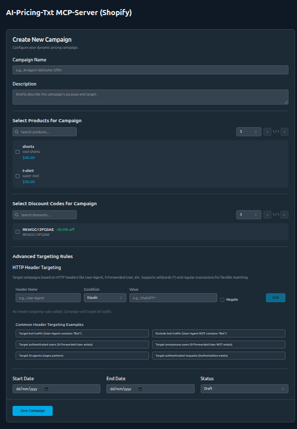

# Campaign Builder AI-Pricing.txt

This project is a component of the AI-Pricing-txt project that enables the creation and management of AI-aware Shopify campaigns.

## 🛒 AI-Aware Shopify Campaign App

This project is a proof-of-concept app that integrates with Shopify to:

* Automatically fetch **products** and **discount codes** using the Shopify Admin API.
* Allow merchants to create **campaigns** that link selected products and existing Shopify coupons to specific `user_email` identifiers.
* Expose a simple **MCP server endpoint** for authenticated AI agents to retrieve personalized, discounted product data.

AI agents authenticate via HTTP headers (e.g., `x-user-email`) and can retrieve campaign-specific pricing via the `/mcp` endpoint using the `get-products` and `get-discount` tools.

Great for experimenting with **agent-friendly pricing models** and **AI-accessible product catalogs**.

Im

## Stack

- React+Typescript frontend with `yarn` as package manager.
- Python FastAPI server with `uv` as package manager.
- MCP server for AI agent interaction.

## Installing UV
Use curl to download the script and execute it with sh:

```curl -LsSf https://astral.sh/uv/install.sh | sh```

If your system doesn't have curl, you can use wget:

```wget -qO- https://astral.sh/uv/install.sh | sh```

After installation, restart your shell

## Quickstart

1. Install dependencies:

```bash
make
```

2. Start the backend, MCP server, and frontend servers in separate terminals:

```bash
make run-backend
make run-mcp
make run-frontend
```

## API Access Token for Shopify 

### Step-by-Step: Get Shopify Admin API Access Token

1. **Log into Your Shopify Admin**
   - Go to: `https://your-store.myshopify.com/admin`

2. **Enable App Development**
   - Go to Apps from the left sidebar
   - Scroll to the bottom and click "App and sales channel settings"
   - Click "Develop apps for your store"
   - Enable custom app development (one-time prompt)

3. **Create a Custom App**
   - Go to Apps > Develop apps
   - Click "Create an app"
   - Give it a name (e.g., ProductDiscountSyncApp)
   - Choose a developer contact

4. **Configure Admin API Scopes**
   - Click on your app, then:
   - Go to Configuration
   - Under Admin API integration, click Configure
   - Add read access for the following:
     - `read_products`
     - `read_price_rules`
     - `read_discounts`
   - Click Save when done.

5. **Install the App**
   - Go back to the app's main page
   - Click Install app (top right)

6. **Get Your Access Token**
   - Go to the API credentials tab
   - You'll see Admin API access token
   - Click Reveal token once
   - Copy and store it securely — you won't see it again!

7. **Configure Your .env File**
   - Copy `backend/.env.example` to `backend/.env`
   - Add your Shopify store URL and access token

### Test Your Shopify API Access

```bash
curl -X GET "https://your-store.myshopify.com/admin/api/2023-10/products.json" \
     -H "X-Shopify-Access-Token: your_access_token_here"
```

## Architecture

This application is designed to work with a Traefik reverse proxy setup:

- The FastAPI backend server handles product and campaign management
- The MCP server provides AI-friendly endpoints for retrieving pricing information
- The React frontend provides a user interface for managing campaigns

## Gotchas

The backend server runs on port 8003, the MCP server runs on port 3001, and the frontend development server runs on port 5173. The frontend Vite server proxies API requests to the backend on port 8003.

Visit <http://localhost:5173> to view the application.
